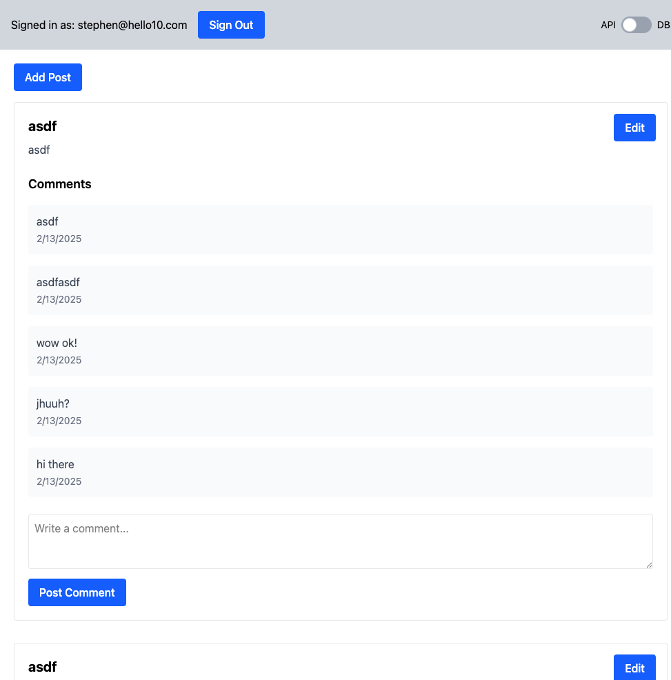

# Basic test

Trying out [basic.tech](https://basic.tech) with a very basic blog + comment schema



# Schema
```
"post": {
    "type": "collection",
    "fields": {
        "title": {
            "type": "string",
            "indexed": true
        },
        "body": {
            "type": "string",
            "indexed": true
        }
    }
},
"comment": {
    "type": "collection",
    "fields": {
        "post_id": {
            "type": "string",
            "indexed": true
        },
        "body": {
            "type": "string",
            "indexed": true
        }
    }
}
```

# Setup

```bash
npm instal;
cp .env.example .env
```

Then set project details in [.env](./.env) based on [.env.example](./.env.example)

# Run
```bash
npm run dev
```
